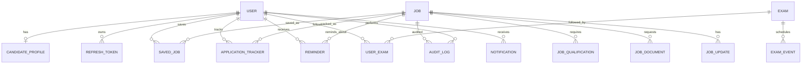

# NaukriSetu

Personalized government-job discovery: show candidates jobs they may qualify for, explain why, and link back to official sources.

## Architecture

```mermaid
flowchart LR
  Browser[Next.js App Router] -->|HTTPS / JWT| API[Express API]
  API --> Prisma[Prisma ORM]
  Prisma --> Mongo[(MongoDB Atlas)]
  API --> Redis[(Redis cache / rate limits)]
  API --> Files[Private object storage for notifications]
  Admin[Admin workspace] --> API
```



The Next.js frontend is a mobile-first SSR application deployed to Vercel. The Node.js/Express API is independently deployable to AWS, Render, or Railway. MongoDB Atlas is the source of truth, Prisma owns the schema, and Redis is an optional cache/rate-limit layer. Search uses indexed structured filters initially; a search adapter can isolate a future Atlas Search/OpenSearch integration. Notifications are stored in private object storage and served via short-lived authorized URLs. Secrets remain server-side.

Authentication uses short-lived JWT access tokens and rotating, hashed refresh tokens in secure, HttpOnly, SameSite cookies. Passwords use Argon2id. Admin roles are Super Admin, Editor, and Moderator, with server-enforced permissions and append-only audit events. API inputs are validated, parameterized through Prisma, rate-limited, and protected against CSRF on cookie-authenticated mutations. Uploads are type/size checked and malware-scanned before publication.

## ER diagram



## Database schema

The normalized Prisma schema lives in `apps/api/prisma/schema.prisma`. It covers users, candidate profiles, jobs and eligibility criteria, official-source verification and update history, documents, results/admit cards/answer keys, exams and events, saved jobs, application tracking, reminders, followed exams, notifications, and admin audit logs. IDs and references use MongoDB ObjectIds. Age, category, domicile, qualification, experience, percentage, and other criteria are nullable/explicit; unknown requirements resolve to “Check notification,” never an unsupported eligible claim. Production data must be entered from official notifications and verified URLs only. No seed jobs or live recruitment data are bundled.

## API list (v1)

| Method | Route | Access | Purpose |
|---|---|---|---|
| POST | `/api/v1/auth/register`, `/login`, `/refresh`, `/logout` | Public / session | Secure account lifecycle |
| GET/PATCH | `/api/v1/me`, `/api/v1/me/profile` | User | Profile and preferences |
| GET | `/api/v1/jobs` | Public | Search/filter/page jobs |
| GET | `/api/v1/jobs/:slug` | Public | Job and source details |
| POST | `/api/v1/jobs/:id/eligibility` | Public | Explain eligibility or manual checks |
| POST | `/api/v1/assistant` | Public | Search published listings; never invents vacancies or dates |
| GET/POST | `/api/v1/me/saved-jobs` | User | List and save published jobs |
| DELETE | `/api/v1/me/saved-jobs/:jobId` | User | Remove a saved job |
| GET | `/api/v1/me/applications` | User | List tracked applications |
| PUT | `/api/v1/me/applications/:jobId` | User | Create or update application status |
| GET | `/api/v1/me/reminders` | User | List deadline reminder preferences |
| PUT/DELETE | `/api/v1/me/reminders/:jobId` | User | Set or clear reminder offsets |
| GET | `/api/v1/me/followed-exams` | User | Followed exams and recorded milestones |
| POST/DELETE | `/api/v1/me/followed-exams` | User | Follow/unfollow exam records |
| GET | `/api/v1/results`, `/admit-cards`, `/answer-keys` | Public | Published recruitment updates |
| GET | `/api/v1/jobs/:slug/updates` | Public | Published updates for a recruitment |
| GET | `/api/v1/exams`, `/exams/:slug`, `/calendar` | Public | Exam records, milestones, and dates |
| POST | `/api/v1/admin/jobs/:id/updates` | Editor+ | Create an update draft |
| POST | `/api/v1/admin/updates/:id/publish` | Editor+ | Publish after source checks |
| POST | `/api/v1/admin/exams`, `/exams/:id/events` | Editor+ | Create exams and milestones |
| GET | `/api/v1/admin/jobs`, `/analytics` | Editor+ | Manage listings and review metrics |
| GET | `/api/v1/admin/audit-logs`, `/users` | Super Admin | Audit activity and list accounts |
| PATCH | `/api/v1/admin/users/:id/role` | Super Admin | Change role with an audit record |
| GET | `/api/v1/admin/source-snapshots` | Editor+ | Review official source intake observations |
| PATCH | `/api/v1/admin/source-snapshots/:id/review` | Editor+ | Record human review without publishing a job |
| GET/POST | `/api/v1/admin/jobs` | Editor+ | Draft and manage listings |
| PATCH/DELETE | `/api/v1/admin/jobs/:id` | Editor+ | Update/archive listings |
| POST | `/api/v1/admin/jobs/:id/publish` | Editor+ | Publish after source review |
| POST | `/api/v1/admin/uploads` | Editor+ | Validate private notification uploads |
| GET | `/api/v1/admin/analytics`, `/audit-logs` | Admin | Analytics and audit history |

Public listing endpoints are paginated and cached briefly. Admin mutations require role checks, CSRF protection, and audit records. No AI endpoint may produce factual vacancies or dates outside the indexed database.

## Folder structure

```text
apps/
  web/                 Next.js App Router, Tailwind, public and account pages
  api/                 Express, validation, auth, services, Prisma schema
packages/
  shared/              Shared schemas, enums and API types
docs/                  Architecture and operational notes
```

## User flow

Visitor searches or browses jobs, opens a listing, reviews its official source and verification timestamp, then uses the eligibility checker. Users can create an account, complete a profile, save jobs, choose reminders, and track each application state. Dashboard recommendations explain matched criteria and surface unknown conditions as manual checks. Following an exam creates a preparation workspace whose official dates are separated from community/AI study material.

## Admin flow

An authorized editor creates a draft from an official notification, records the source URL, organization, notification/verification dates, criteria, vacancies, and application dates, and uploads the PDF through validated private storage. A reviewer checks source and fields before publishing. Changes and publication actions are logged with actor and timestamp. Super Admin manages roles; Moderator handles reports and verification queues.

## Implementation status

Implemented in this repository: account registration/login with hashed passwords and rotating refresh tokens; candidate profiles and conservative eligibility checks; filtered job search; saved jobs, application states, and reminder preferences; public result/admit-card/answer-key feeds; exam/calendar pages and following; preparation views; a database-grounded keyword assistant; admin job/update/exam workflows, role changes, analytics/audit reads; and canonical/OG metadata, robots rules, and a content-aware sitemap.

The assistant is a database-grounded search with an optional OpenRouter response layer. When `OPENROUTER_API_KEY` is configured, the model receives only matched published records and is instructed not to invent vacancies, dates, eligibility, salary, organizations, or links; deterministic database results remain the fallback. Public job feeds exclude expired application deadlines, and admin job creation/update now uses a recruitment fingerprint to block likely duplicate active listings. Reminder preferences persist, but no email/push delivery worker or provider is configured. Private PDF storage, malware scanning, AdSense, affiliate links, premium billing, and analytics integrations are not connected. Scheme, scholarship, and previous-paper pages remain empty because no source-backed content models/data have been supplied. The homepage displays only published API records and has explicit empty states when none exist.

The official-source intake batch is staged at `apps/api/data/central-recruitment-source-intake.json`. It has 13 observations from SSC, UPSC, IBPS, and the RRB Apply portal, checked on 2026-09-28. After configuring MongoDB Atlas and running `npm run db:push`, load it with `npm run db:ingest:central`. Imported snapshots remain `REVIEW_REQUIRED`; they are not jobs and do not enter public feeds until a human reviews the original notice and separately creates/publishes a job or update. Some PDFs could not be extracted, so missing fields and direct-link gaps are explicitly recorded.

## Production prerequisites

This is an implemented application scaffold, not a production launch by itself. Configure MongoDB Atlas as a replica set and run Prisma generation/schema push; set strong JWT secrets, `WEB_ORIGIN`, `API_URL`, and `SITE_URL`; provision the first Super Admin out-of-band; review staged source observations and add records only after verifying current official notices; and configure backups, monitoring, mail/reminder delivery, private file storage/scanning, and deployment secrets. Prisma interactive transactions require a replica-set deployment. No jobs are auto-created from the source intake batch. Expired published listings are hidden automatically from public feeds; they should be archived during routine admin maintenance. Privacy/terms are draft/noindex and need operator and legal review before launch.

## Run locally

Requires Node.js 20+ and MongoDB (Atlas recommended; local MongoDB works for development). Copy `apps/api/.env.example` to `apps/api/.env` and `apps/web/.env.example` to `apps/web/.env.local`, set a rotated MongoDB connection URL and local secrets, then run `npm install`, `npm run db:generate`, and `npm run db:push`. Start frontend and API in separate terminals with `npm run dev` and `npm run dev:api`. Public registration creates normal users only. Do not commit `.env` files or share database credentials in chat. No fabricated database listings are included; enter only current, source-checked recruitment records.
